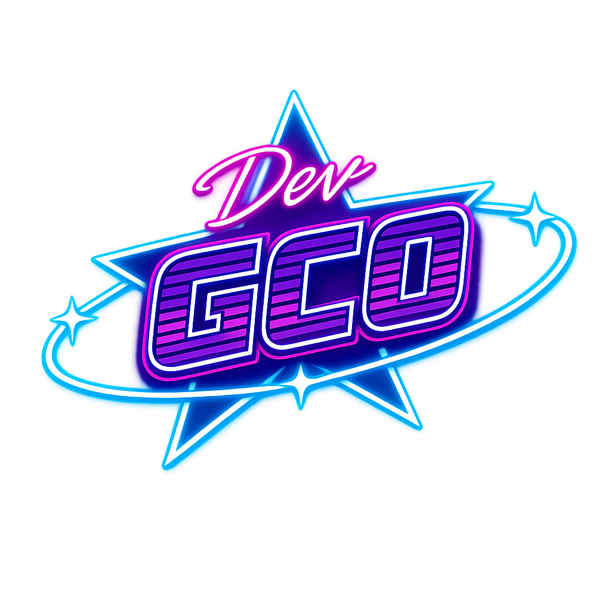

  

   

  
  
   

  

---

### 🌴 Aesthetic Lab | Transição de Carreira
Trago a precisão do setor **Administrativo** para a construção de interfaces modernas e imersivas. Atualmente focado no ecossistema Front-end, com o objetivo de me tornar um desenvolvedor Full-stack completo.

* 🚀 **Projetos Atuais:** Smart Clinic System.
* 🛠️ **Foco:** React, Angular e JavaScript Moderno.
* 🎨 **Estética:** Vaporwave & High-end Web Design.

---

### 📊 My Stats

  
  

 

  
  
  
  
  

  

  

  ---

  
  

